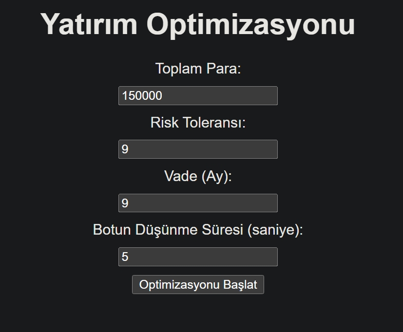
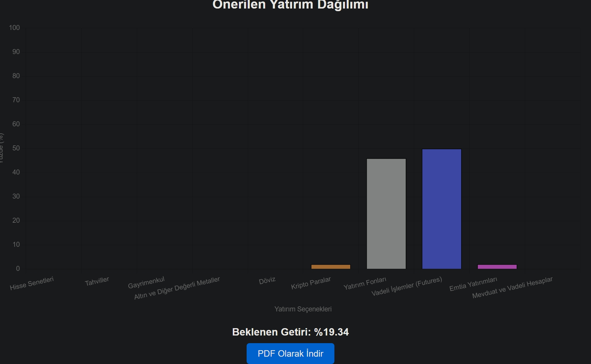
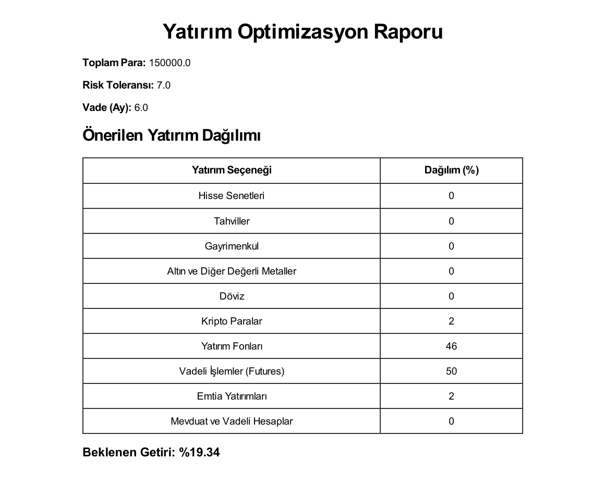

Test Results Report Document
======================================================================

List of Contributors:
----------------------
Tuna Kömürcü

Table of Contents:
------------------
1. Test Results Overview
2. Test Results Analysis
3. Logs and Outputs

----------------------------------------------------------------------
Test Results Overview
----------------------------------------------------------------------
Aşağıdaki özet, QA dokümanında yer alan test case’lerine göre elde edilen sonuçları göstermektedir:

- **TC-01: Yatırım Girdisi Doğrulama**  
  - **Sonuç:** Pass  
  - **Notlar:** Kullanıcı formundaki girdiler doğru alındı, %100 yüzdelik dağılım hesaplandı.

- **TC-02: Yapay Zeka Portföy Analizi**  
  - **Sonuç:** Pass  
  - **Notlar:** Portföy analizi sonucunda beklenen dağılım ve gelir tahmini başarıyla oluşturuldu.

- **TC-03: Grafiksel Görselleştirme**  
  - **Sonuç:** Pass  
  - **Notlar:** Bar grafik, tüm yatırım seçeneklerinin yüzdelik değerlerini doğru ve responsive biçimde gösterdi.

- **TC-04: PDF Rapor İndirme Fonksiyonu**  
  - **Sonuç:** Pass  
  - **Notlar:** PDF raporu oluşturuldu ve indirilebilir durumda; rapor tüm gerekli bilgileri içeriyor.

- **TC-05: Performans Testi**  
  - **Sonuç:** Pass  
  - **Notlar:** Sistem, belirlenen maksimum süre (örneğin, 5 saniye) içerisinde sonuç üretmiş ve işlem süreleri onaylanmıştır.

----------------------------------------------------------------------
Test Results Analysis
----------------------------------------------------------------------
- **Genel Değerlendirme:**  
  Tüm test case’leri, belirlenen kabul kriterlerini başarıyla karşılamıştır.  
- **Öne Çıkan Noktalar:**  
  - Kullanıcı girdilerinin doğruluğu ve validasyon süreci başarılı sonuçlanmıştır.  
  - Yapay zeka portföy analizi, mantıklı dağılımlar ve gelir tahmini sunmuştur.  
  - Grafiksel görselleştirme, tüm cihazlarda uyumlu çalışmış ve kullanıcı dostu bir arayüz sağlamıştır.  
  - PDF raporu eksiksiz ve düzenli olarak oluşturulmuştur.  
- **İyileştirme Önerileri:**  
  - Performans testlerinde daha yüksek yük altında ek testler yapılabilir.  
  - Loglama mekanizması detaylandırılarak hata durumlarında daha kapsamlı bilgi sağlanabilir.

----------------------------------------------------------------------
Logs and Outputs
----------------------------------------------------------------------
- **Log Örnekleri:**  
  - Uygulama başlangıç logları, API çağrıları ve hata logları incelendi; kritik bir hata rapor edilmedi.  
  - PDF oluşturma sürecine ait log çıktıları, raporun doğru içerikle üretildiğini göstermektedir.  
- **Önemli Çıktılar:**  
  - Yüzdelik dağılımın %100 olduğu ve her yatırım seçeneği için doğru oranların hesaplandığı gözlemlenmiştir.  
  - İşlem süreleri, belirlenen zaman sınırı içerisinde tamamlanmıştır.

  
  
  
  

